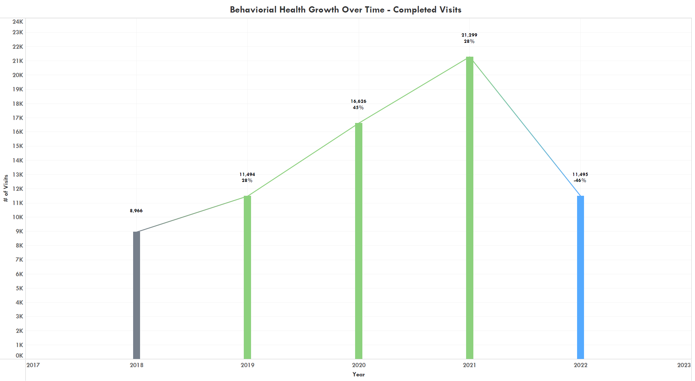

```{r , echo = FALSE , message = FALSE , warning = FALSE}
 
setwd("~/GitHub/Annual-Medical-Highlight")

library( dplyr )

library( readr )

library( ggpubr)

library( magrittr )


Medical_Data <- read.csv( 'Output.csv' )

Medical_Data %<>%  rename( 'Count' = 'ï..Count')

Encounter_Data <- Medical_Data %>% filter( Type == 'Encounter' )


```


     

# <span style="color:Crimson"> *Behavioral Health*  </span>

### <span style="color:RoyalBlue"> *# of Completed Visits* </span>



&nbsp;

| Year   | 2018     |  2019      |  2020     |  2021     |
|--------|----------|------------|-----------|-----------|
| Count  |  $8966$  |  $11494$   |  $16626$  |  $21299$  | 
| $\%$   |          |  $+28\%$   |  $+45\%$  |  $+28\%$  |


&nbsp;


### <span style="color:RoyalBlue"> *# of Unique Patients Seen* </span>


&nbsp;

| Year   | 2018     |  2019      |  2020     |  2021     |
|--------|----------|------------|-----------|-----------|
| Count  |  $2027$  |  $2796$    |  $2782$   |  $2964$   | 
| $\%$   |          |  $+38\%$   |  $-1\%$   |  $+7\%$   |


&nbsp;


_________________________________


# <span style="color:Crimson"> *Dental* </span>


###  <span style="color:RoyalBlue"> *# of Completed Visits*   </span>


&nbsp;

| Year   | 2018     |  2019      |  2020     |  2021     |
|--------|----------|------------|-----------|-----------|
| Count  |  $13594$ |  $16414$   |  $9656$   |  $14548$  | 
| $\%$   |          |  $+21\%$   | $-41\%$   |  $+51\%$  |


&nbsp;


###  <span style="color:RoyalBlue"> *# of Unique Patients Seen*   </span>


&nbsp;

| Year   | 2018     |  2019      |  2020     |  2021     |
|--------|----------|------------|-----------|-----------|
| Count  |  $3795$  |  $4832$    |  $4210$   |  $4855$   | 
| $\%$   |          |  $+27\%$   | $-13\%$   | $+15\%$   |


&nbsp;


__________________________


# <span style="color:Crimson"> *Family Medicine* </span>

###  <span style="color:RoyalBlue">  *# of Completed Visits*  </span>


&nbsp;

| Year   | 2018     |  2019      |  2020     |  2021     |
|--------|----------|------------|-----------|-----------|
| Count  |  $25682$ |  $32690$   |  $48583$  |  $59389$  | 
| $\%$   |          |  $+27\%$   |  $+49\%$  |  $+22\%$  |


&nbsp;


###  <span style="color:RoyalBlue"> *# of Unique Patients Seen*  </span>


&nbsp;

| Year   | 2018     |  2019      |  2020     |  2021     |
|--------|----------|------------|-----------|-----------|
| Count  |  $7636$  |  $10605$   |  $18224$  |  $20379$  | 
| $\%$   |          |  $+39\%$   | $+72\%$   |  $+12\%$  |


&nbsp;


_______________________


# <span style="color:Crimson"> *Internal Medicine*  </span>

###  <span style="color:RoyalBlue"> *# of Completed Visits*  </span>


&nbsp;

| Year   | 2018      |  2019      |  2020     |  2021     |
|--------|-----------|------------|-----------|-----------|
| Count  |  $23941$  |  $23717$   |  $24170$  |  $21533$  | 
| $\%$   |           |  $-1\%$    | $+2\%$    | $-11\%$   |


&nbsp;


##  <span style="color:RoyalBlue">  *# of Unique Patients Seen*  </span>


&nbsp;

| Year   | 2018     |  2019      |  2020     |  2021     |
|--------|----------|------------|-----------|-----------|
| Count  |  $6948$  |  $6958$    |  $7827$   |  $6645$   | 
| $\%$   |          |  $<1\%$    | $+12\%$   | $-15\%$   |


&nbsp;

_____________________________


# <span style="color:Crimson"> *Pediatrics*  </span>

###  <span style="color:RoyalBlue">  *# of Completed Visits*  </span>


&nbsp;

| Year   | 2018      |  2019      |  2020     |  2021     |
|--------|-----------|------------|-----------|-----------|
| Count  |  $12216$  |  $13332$   |  $11476$  |  $14120$  | 
| $\%$   |           |  $+9\%$    | $-14\%$   |  $+23\%$  |


&nbsp;


### <span style="color:RoyalBlue">   *# of Unique Patients Seen*  </span>


&nbsp;

| Year   | 2018     |  2019      |  2020     |  2021     |
|--------|----------|------------|-----------|-----------|
| Count  |  $3443$  |  $3692$    |  $3504$   |  $4055$   | 
| $\%$   |          |  $+7\%$    | $-5\%$    | $+16\%$   |


&nbsp;


___________________________________


# <span style="color:Crimson"> *Pediatric Specialties*  </span>

###  <span style="color:RoyalBlue">  *# of Completed Visits*  </span>


&nbsp;

| Year   | 2018     |  2019      |  2020     |  2021     |
|--------|----------|------------|-----------|-----------|
| Count  |  $758$   |  $1311$    |  $1370$   |  $1238$   | 
| $\%$   |          |  $+73\%$   |  $+5\%$   |  $-10\%$  |


&nbsp;


###   <span style="color:RoyalBlue">  *# of Unique Patients Seen*  </span>


&nbsp;

| Year   | 2018     |  2019      |  2020     |  2021     |
|--------|----------|------------|-----------|-----------|
| Count  |  $545$   |  $992$     |  $966$    |  $848$    | 
| $\%$   |          |  $+82\%$   |  $-3\%$   |  $-12\%$  |


&nbsp;


_________________________________


# <span style="color:Crimson"> *Specialties*   </span>

### <span style="color:RoyalBlue">  *# of Completed Visits*  </span>


&nbsp;

| Year   | 2018      |  2019      |  2020     |  2021      |
|--------|-----------|------------|-----------|------------|
| Count  |  $20603$  |  $24337$   |  $24246$  |  $27960$   | 
| $\%$   |           |  $+18\%$   |  $<0\%$   |  $+15\%$   |


&nbsp;


### <span style="color:RoyalBlue">  *# of Unique Patients Seen*  </span>


&nbsp;

| Year   | 2018     |  2019      |  2020     |  2021     |
|--------|----------|------------|-----------|-----------|
| Count  |  $8848$  |  $10519$   |  $10600$  |  $11424$  | 
| $\%$   |          |  $+19\%$   | $+1\%$    |  $+8\%$   |


&nbsp;


__________________________________


# <span style="color:Crimson"> *Womens Health*  </span>

###  <span style="color:RoyalBlue">  *# of Completed Visits*  </span>


&nbsp;

| Year   | 2018      |  2019      |  2020     |  2021     |
|--------|-----------|------------|-----------|-----------|
| Count  |  $12216$  |  $13332$   |  $11476$  |  $14120$  | 
| $\%$   |           |  $+9\%$    | $-14\%$   |  $+23\%$  |


&nbsp;


###  <span style="color:RoyalBlue">  *# of Unique Patients Seen*  </span>


&nbsp;

| Year   | 2018     |  2019      |  2020     |  2021     |
|--------|----------|------------|-----------|-----------|
| Count  |  $3443$  |  $3692$   |  $3504$  |  $4055$  | 
| $\%$   |          |  $+7\%$   | $-5\%$   | $+16\%$   |


&nbsp;


